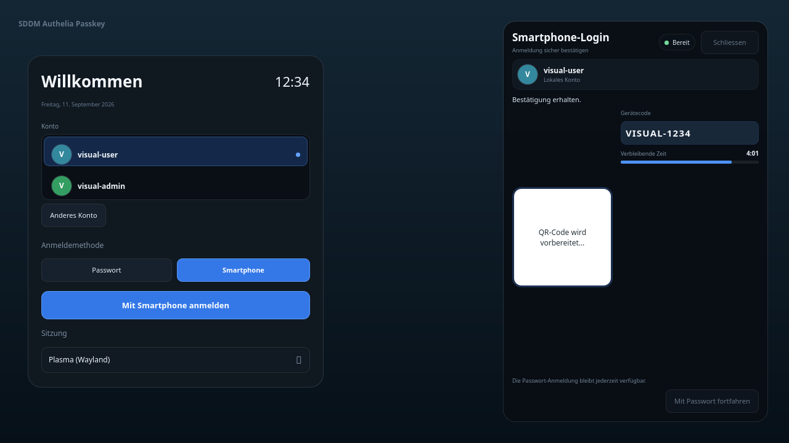

<div align="center">

# 🔐 SDDM Authelia Passkey

**Passwordless SDDM login with Authelia Device Authorization, WebAuthn/passkeys and a fail-safe password fallback.**

[](https://github.com/BenJule/sddm-authelia-passkey/actions/workflows/build.yml)
[](https://github.com/BenJule/sddm-authelia-passkey/actions/workflows/test.yml)
[](https://github.com/BenJule/sddm-authelia-passkey/actions/workflows/native-theme.yml)
[](https://github.com/BenJule/sddm-authelia-passkey/actions/workflows/codeql.yml)
[](https://github.com/BenJule/sddm-authelia-passkey/actions/workflows/security.yml)
[](https://github.com/BenJule/sddm-authelia-passkey/releases/latest)
[](LICENSE)


[Website](https://benjule.github.io/sddm-authelia-passkey/) · [Installation](#-installation) · [Features](#-features) · [Architecture](#-architecture) · [Roadmap](https://github.com/users/BenJule/projects/2) · [Security](#-security) · [Documentation](#-documentation) · [Contributing](#-contributing)

<br>



</div>

---

Approve an SDDM login on your phone with a passkey instead of typing your Linux password. The project uses the OIDC Device Authorization Grant for the out-of-band approval and keeps the existing password path structurally intact as the fallback.

**Status: stable within the documented validated scope.** The current reference environment is Debian 13 (Trixie), SDDM 0.21.x, KDE Plasma 6, Authelia 4.39+ and systemd 257+. The project is still single-maintainer and has not yet been validated across a broad independent hardware and distribution matrix. See [Validated Environment](docs/validated-environment.md), [Security](docs/security.md) and the [Threat Model](docs/threat-model.md) before deploying.

## ✨ What this project adds

| Area | Details |
|------|---------|
| **Passwordless SDDM login** | QR/device flow with WebAuthn/passkey approval on a phone or authenticator |
| **Safe password fallback** | The PAM integration is additive; absent, invalid or expired approval falls through to the normal password path |
| **Identity binding** | Exact-match identity checks with local accounts or opt-in NSS/SSSD backed accounts |
| **Provider abstraction** | Authelia by default, plus standards-compliant OIDC Device Authorization providers through discovery |
| **Native hardware keys** | Optional FIDO2/U2F support through upstream `pam_u2f` |
| **KWallet integration** | Optional auto-unlock using a dedicated root-only secret service and `systemd-creds` |
| **Three theme modes** | Native Qt6 theme, compatibility theme, or backend/PAM-only mode |
| **Recovery tooling** | Read-only preflight/admin checks, postflight validation, rollback and independent break-glass recovery |
| **Supply-chain controls** | Signed `.deb` releases, SBOMs, CodeQL, dependency review and a signed Debian APT mirror |
| **Visual regression** | Deterministic Native Theme screenshot coverage across 26 visual cases |

## 📦 Installation

### Debian 13 APT repository

```bash
curl -fsSL https://apt.s3-dev.ovh/trixie-KEY.gpg | sudo gpg --dearmor -o /etc/apt/trusted.gpg.d/sddm-authelia-passkey-repo.gpg
echo "deb [signed-by=/etc/apt/trusted.gpg.d/sddm-authelia-passkey-repo.gpg] https://apt.s3-dev.ovh trixie main" | sudo tee /etc/apt/sources.list.d/sddm-authelia-passkey.list
sudo apt update
sudo apt install sddm-authelia-passkey
```

The APT repository mirrors the same signed package published on [GitHub Releases](https://github.com/BenJule/sddm-authelia-passkey/releases). Direct `.deb` installation is also supported. See [Release Signing](docs/release-signing.md) for verification instructions.

### Required post-install steps

1. Copy and edit `/etc/sddm-authelia-passkey/config.conf.example` as `/etc/sddm-authelia-passkey/config.conf`.
2. Configure at least `authelia_base_url`, `allowed_verification_host` and the local account policy.
3. Run the read-only preflight:

   ```bash
   sudo /usr/share/sddm-authelia-passkey/preflight.sh
   ```

4. Enable the PAM integration:

   ```bash
   sudo /usr/share/sddm-authelia-passkey/enable-pam.sh
   ```

5. Start the broker:

   ```bash
   sudo systemctl enable --now sddm-authelia-passkey-broker.service
   ```

6. Run the postflight check and choose an explicit theme mode:

   ```bash
   sudo /usr/share/sddm-authelia-passkey/postflight.sh
   sudo sddm-authelia-passkey-admin apply-mode native
   ```

7. Log out and test a normal password login **first**, then test the smartphone/passkey flow.

Nothing in the installer restarts SDDM automatically. See the full [Installation Guide](docs/installation.md) before changing a production login stack.

## 🚀 Features

**Authentication**

- OIDC Device Authorization Grant (RFC 8628)
- WebAuthn/passkey user verification through the identity provider
- Single-use, short-TTL approval markers
- Server-side account allowlist and exact username binding
- Generic OIDC provider mode in addition to Authelia
- Optional FIDO2/U2F hardware security keys through `pam_u2f`
- Password login remains available and unchanged as the fallback

**Desktop and identity**

- Native Qt6 SDDM theme with responsive and accessibility-tested states
- Compatibility mode for Debian Breeze
- Backend/PAM-only deployment mode with no theme change
- Optional branding, avatar and local hostname/domain presentation
- Local-account or NSS/SSSD-backed identity resolution
- Optional KWallet auto-unlock

**Operations and recovery**

- `sddm-authelia-passkey-admin` read-only status and configuration checks
- Fail-safe PAM preflight that refuses unknown stack shapes instead of guessing
- Idempotent enable/disable and migration tooling
- Independent rollback and break-glass paths
- Signed Debian packages, checksums and SBOM release assets
- Automated build, test, package, theme, CodeQL and security workflows

## 🧩 Architecture

Authentication proof and Unix identity are deliberately separate:

```text
OIDC / Authelia / generic provider
        │
        │ device authorization + passkey approval
        ▼
      broker
        │
        │ root-owned, single-use approval marker
        ▼
 pam_authelia_passkey.so
        │
        ├── valid marker ─────────────▶ PAM_SUCCESS
        │                                │
        │                                └── optional KWallet hand-off
        │
        └── no valid marker ──────────▶ normal common-auth/password path

Unix account identity is resolved separately through local NSS/SSSD policy.
```

The broker performs the long-running device flow outside SDDM's PAM conversation. The PAM module only answers the final question: whether a valid approval marker already exists for the exact selected account.

See [Architecture](docs/architecture.md) for the full Mermaid diagrams, PAM control flow and trust-boundary rationale.

## 🎨 Theme modes

| Mode | Purpose |
|------|---------|
| **Native** | Original Qt6 SDDM theme with the complete project UX |
| **Compatibility** | Small additive patches against Debian Breeze |
| **Backend only** | Authentication integration without changing the active SDDM theme |

Switch modes explicitly with `sddm-authelia-passkey-admin apply-mode`. Installation and upgrades do not silently choose a mode for you.

## ✅ Validated environment

| Component | Validated version |
|-----------|-------------------|
| OS | Debian 13 (Trixie) |
| Display manager | SDDM 0.21.x |
| Desktop | KDE Plasma 6 |
| Identity provider | Authelia 4.39+ |
| Init system | systemd 257+ |

Other distributions, display managers and older stacks are unsupported or experimental unless documented otherwise. The safety policy is to refuse an unknown PAM shape rather than attempt a speculative modification.

## 🔄 Development and release flow

```text
feature/fix branch ──PR──▶ main ──tag/release──▶ signed .deb + SBOM + APT mirror
```

- Changes are developed on focused branches and reviewed through pull requests.
- Build, test, native-theme, package and security workflows validate the repository continuously.
- Tagged releases publish the Debian package and verification assets on GitHub Releases.
- The APT deployment workflow independently verifies release state, package metadata, checksum and maintainer signature before publishing.

See [Development](docs/development.md), [Testing](docs/testing.md), [Supply Chain](docs/supply-chain.md) and [APT Repository](docs/apt-repository.md).

Active work is tracked in the public [SDDM Authelia Passkey Development](https://github.com/users/BenJule/projects/2) project and grouped by GitHub release milestones; [docs/roadmap.md](docs/roadmap.md) remains the detailed technical roadmap.

## 🔒 Security

Security is part of the design rather than an optional layer:

- Password authentication remains the unchanged fallback path.
- Approval markers are root-owned, short-lived and single-use.
- Provider identity is exact-matched to the selected Unix account.
- KWallet hand-off uses a separate root-only AF_UNIX channel and short-lived marker.
- The broker's local API is loopback-only; the approval marker remains the PAM trust boundary.
- Unknown PAM layouts are refused instead of modified heuristically.
- CodeQL, dependency review, hardened compiler/linker flags and release verification are part of CI/release handling.

Please report vulnerabilities privately through [GitHub Security Advisories](https://github.com/BenJule/sddm-authelia-passkey/security/advisories/new). Do **not** open a public security issue. See [SECURITY.md](SECURITY.md), [Security Design](docs/security.md) and the [Threat Model](docs/threat-model.md).

## 📚 Documentation

| Topic | Documentation |
|-------|---------------|
| Installation | [docs/installation.md](docs/installation.md) |
| Configuration | [docs/configuration.md](docs/configuration.md) |
| Architecture | [docs/architecture.md](docs/architecture.md) |
| Native Theme | [docs/native-theme.md](docs/native-theme.md) |
| Theme modes and migration | [docs/theme-installation-modes.md](docs/theme-installation-modes.md) |
| Branding | [docs/branding.md](docs/branding.md) |
| FIDO2/U2F | [docs/fido2.md](docs/fido2.md) |
| KWallet | [docs/kwallet.md](docs/kwallet.md) |
| Accessibility | [docs/accessibility.md](docs/accessibility.md) |
| Upgrade | [docs/upgrade.md](docs/upgrade.md) |
| Rollback and recovery | [docs/rollback.md](docs/rollback.md) |
| Release signing | [docs/release-signing.md](docs/release-signing.md) |
| Supply chain | [docs/supply-chain.md](docs/supply-chain.md) |
| Validated environment | [docs/validated-environment.md](docs/validated-environment.md) |
| Live development roadmap | [GitHub Project](https://github.com/users/BenJule/projects/2) |
| Technical roadmap | [docs/roadmap.md](docs/roadmap.md) |

## 🤝 Contributing

Contributions are welcome. Keep each pull request focused, include tests for new behavior and document any security-boundary change. Changes touching PAM must preserve the invariant that a missing or failed passkey approval falls through to the existing password path.

See [CONTRIBUTING.md](CONTRIBUTING.md) and the [pull request template](.github/PULL_REQUEST_TEMPLATE.md) before opening a change.

## 📄 License

The project's own code is licensed under the **MIT License**. Optional compatibility-theme integration is shipped as small patches against Debian Breeze rather than as a vendored copy. See [LICENSE](LICENSE) and the theme [provenance notes](theme/native/PROVENANCE.md).

## 🙏 Acknowledgements

Built around open standards and upstream components including [SDDM](https://github.com/sddm/sddm), [Authelia](https://www.authelia.com/), KDE/Plasma, Linux PAM, `pam_u2f`, WebAuthn and OpenID Connect.
