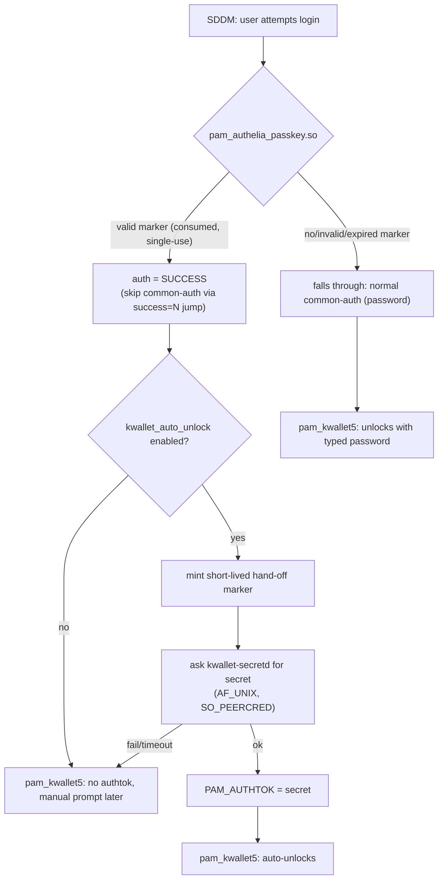

# Architecture

## Components

- **broker** (`src/broker`) - talks to Authelia's OIDC Device Authorization
  endpoints (RFC 8628), renders the QR code, and writes a root-owned,
  single-use, short-TTL approval marker file on success. Never talks to
  PAM. Its local HTTP API (127.0.0.1 only) is not the trust boundary -
  the marker file is.
- **pam_authelia_passkey.so** (`src/pam`) - a native PAM auth module and
  the sole consumer of that marker. On a valid marker it commits to
  `PAM_SUCCESS` unconditionally; optionally (if `kwallet_auto_unlock` is
  configured) it then makes a best-effort attempt to also unlock KWallet,
  which can never turn the already-decided login into a failure.
- **kwallet-secretd** (`src/kwallet-secretd`) - optional. Releases a
  KWallet-unlock secret to the PAM module over a root-only AF_UNIX
  socket, gated by a second, separate, even-shorter-TTL hand-off marker
  that only the PAM module can mint (see below for why).
- **theme patch** (`theme/`) - a diff for `sddm-theme-debian-breeze` adding
  a "Smartphone-Login" action button (alongside Sleep/Restart/Shut Down/
  Other) that opens a right-anchored sidebar with the QR code, matching the
  existing action row's style rather than a floating overlay.

## Why a separate broker process at all?

SDDM's PAM service name is hardcoded in its source
(`src/helper/backend/PamBackend.cpp`): `"sddm"` for a normal login,
`"sddm-greeter"` only for the greeter's own bootstrap session, or
`"sddm-autologin"` for OS-level autologin. It is never configurable from
a theme, `sddm.conf`, or environment variable, which rules out the
"separate PAM service per login method" pattern some other display
managers support. SDDM also only ever asks PAM for a single conversation
step (username + one secret) - see the open upstream issue
[sddm/sddm#2098](https://github.com/sddm/sddm/issues/2098) tracking
native multi-step/async PAM support, which as of this writing has no
linked PR.

Given that, the device-authorization flow (which involves polling over
tens of seconds while a human approves on their phone) cannot happen
inside SDDM's own PAM conversation at all. It has to happen out of band,
in a companion process, with PAM only ever asked a single yes/no question
at the end: "has a marker already been approved for this user?".

## PAM control flow



The `[success=N default=ignore]` extended PAM control syntax is what
makes this safe: `N` is the exact number of lines the local
`@include common-auth` expands to, computed fresh at install time (see
`scripts/enable-pam.sh`), never hardcoded. On success it skips exactly
those `N` lines - never past the following `pam_kwallet5` line - so a
a smartphone/passkey login still reaches `pam_kwallet5` just like a password login
does; on any non-success it changes nothing and password login proceeds
exactly as if this project were not installed.

## Full login flow

```mermaid
sequenceDiagram
    participant User
    participant Theme as SDDM Theme
    participant Broker
    participant Authelia
    participant PAM as pam_authelia_passkey.so
    participant KWallet as kwallet-secretd (optional)

    User->>Theme: click "Smartphone-Login"
    Note over Theme,Broker: username omitted; broker auto-resolves it<br/>when exactly one allowed_user is configured
    Theme->>Broker: POST /start
    Broker->>Authelia: POST /api/oidc/device-authorization
    Authelia-->>Broker: user_code, verification_uri_complete
    Broker-->>Theme: session_id
    Theme->>Theme: render QR from verification_uri_complete
    User->>Authelia: scan QR, WebAuthn/Passkey user verification
    Broker->>Authelia: poll POST /api/oidc/token
    Authelia-->>Broker: access_token (on approval)
    Broker->>Authelia: GET /api/oidc/userinfo (verify username claim)
    Broker->>Broker: write approval marker (root:root, 0600, TTL)
    Theme->>Theme: poll /status, sees "approved" + resolved username
    Note over Theme: idempotent: a stale/duplicate response for a<br/>session that's no longer current is ignored
    Theme->>PAM: sddm.login(resolvedUsername, "", sessionButton.currentIndex)
    PAM->>PAM: consume approval marker, verify TTL
    PAM-->>User: login succeeds
    opt kwallet_auto_unlock=true
        PAM->>KWallet: mint hand-off marker, GET secret (AF_UNIX)
        KWallet-->>PAM: secret (best-effort)
        PAM->>PAM: PAM_AUTHTOK = secret
    end
```

## Duplicate/overlapping flows

Only one flow per user is meant to be "live" at a time. If a new `/start`
arrives for a user who already has an unfinished flow (e.g. the panel was
reopened before the previous attempt finished), the broker marks the prior
flow `cancelled` so its poll loop exits and frees its concurrency slot on
its next iteration - without this, a few overlapping attempts could each
hold one of `max_parallel_flows`' limited slots until their natural 10-
minute deadline, eventually blocking every further login attempt. The
theme's explicit "Abbrechen"/panel-close path calls a dedicated `/cancel`
endpoint for the same reason, rather than relying only on this supersede-
on-next-start behavior. `pixelFlow.open()` in the theme is itself
idempotent - calling it while a flow is already in progress does not start
a second one.

## Multi-user readiness

Full multi-user SDDM UX (account picker driving the smartphone/passkey
flow) is not implemented yet - see `docs/validated-environment.md` for
what is actually validated today (a single `allowed_users` entry, in
both production and lab). `allowed_users` structurally supports more
than one entry already, and every per-flow structure below is already
scoped to exactly one local user - this section documents that binding
explicitly so a future account-picker UI has a clean foundation to build
on, without pretending multi-user is fully supported today.

**Identity binding.** Three distinct usernames are involved in a single
flow, and they must agree by the definition below - anything else is a
`DENY`, not a best-effort guess:

- `REQUESTED_LOCAL_USER` - the local account the flow was started for.
  Either the `username` query parameter on `/start` (validated against
  `allowed_users`), or, only when `allowed_users` has exactly one entry,
  that sole entry (a convenience fallback, not the long-term model - see
  below). Stored as `flowState.Username` for the lifetime of the flow,
  and independently re-derived by PAM via `pam_get_user()` (i.e. from
  SDDM's own login prompt) when a marker is consumed.
- `AUTHENTICATED_AUTHELIA_USER` - the `authelia.pam.username` claim from
  Authelia's `/api/oidc/userinfo` response for the access token the
  device flow produced (`verifyUserinfo` in `src/broker/main.go`).
- `BOUND_LOCAL_USER` - the mapping rule is **exact string match**:
  `pollAndDecide` refuses (`fail(fs, "username mismatch")`, logged at
  `SECURITY` level) unless `AUTHENTICATED_AUTHELIA_USER ==
  REQUESTED_LOCAL_USER`. No fuzzy/heuristic mapping exists or is
  planned; a future explicit static mapping table (Authelia username ->
  local username) is conceivable, but exact match is and remains the
  default.

**Per-user isolation, already true today:**

1. Rate limiting (`limiterFor`), the concurrency cap, and failure
   lockout are all keyed by username (`limiters map[string]*userLimiter`).
2. `supersedePriorFlow`/`lastSessionForUser` are keyed by username - a
   new flow for alice can only ever supersede alice's own prior flow,
   never bob's.
3. `/cancel` operates on an unguessable `session_id` (128 bits of
   randomness from `randomHex`), not a username - cancelling one
   session cannot reach another user's session by construction.
4. Approval markers are filed as `approved-<sanitized username>`
   (`writeApprovalMarker`) and consumed by PAM using its own
   independently-obtained username - PAM can structurally never consume
   a marker for a user other than the one it is actually authenticating.
   The marker's content additionally embeds the UID the broker resolved
   via NSS *at flow-start time* (`VERSION=2`/`USERNAME=`/`UID=` fields);
   PAM re-resolves the account fresh via `getpwnam_r` at consumption
   time and requires an exact UID match, so an account deleted and
   recreated (same username, different UID) between approval and
   consumption fails closed instead of being silently trusted.
5. `allowed_users["root"]` is refused outright at config-load time,
   redundant with (not a replacement for) the PAM stack's own
   `pam_succeed_if.so user != root` line.

See `src/broker/multiuser_test.go` for the tests exercising this
isolation directly (parallel alice/bob flows, cross-user
supersede/cancel rejection, multi-entry `allowed_users` parsing).

**Per-user KWallet credentials.** `kwallet-secretd` resolves a distinct
credential per local user (`kwallet_credential_name` is a *prefix*; the
actual file is `<prefix>.<username>`, e.g. `kwallet.secret.alice` - see
`docs/kwallet.md` and `scripts/setup-kwallet-credential.sh`). The
hand-off marker PAM mints after a successful login also carries the
account's UID, and `kwallet-secretd` refuses to release a secret unless
that UID matches what the requesting PAM process claims - a request
naming "alice" cannot be satisfied by a hand-off marker minted for any
other account, even under a race.

**The single-allowed-user auto-resolution is a convenience fallback,
not the multi-user model.** When `username` is omitted on `/start` and
`allowed_users` has exactly one entry, the broker resolves it
automatically (better UX for the common case). With more than one
entry, an empty `username` is refused (`403`) rather than guessed -
never username enumeration, never an implicit choice. The intended
longer-term flow for real multi-user support is: SDDM's own
account/session picker selects a local username first, which the theme
then passes explicitly to `/start` - not the broker inferring one.

## Trust boundaries

- The broker's HTTP API is localhost-only and never itself authenticates
  anyone - only the approval marker file does.
- The approval marker is root-owned, 0600, single-use (atomically
  renamed-then-checked before being trusted), and short-TTL.
- `kwallet-secretd`'s socket is root-only (`0600`) at the filesystem
  level and additionally checks `SO_PEERCRED` for uid 0, and only ever
  releases a secret in response to a *second*, separate hand-off marker
  that only the already-successful PAM module can mint - it never reads
  or consumes the login-approval marker itself, so there is no
  double-consumer race between the login decision and the secret
  release.
- See `docs/threat-model.md` and `docs/security.md` for the full
  analysis.
