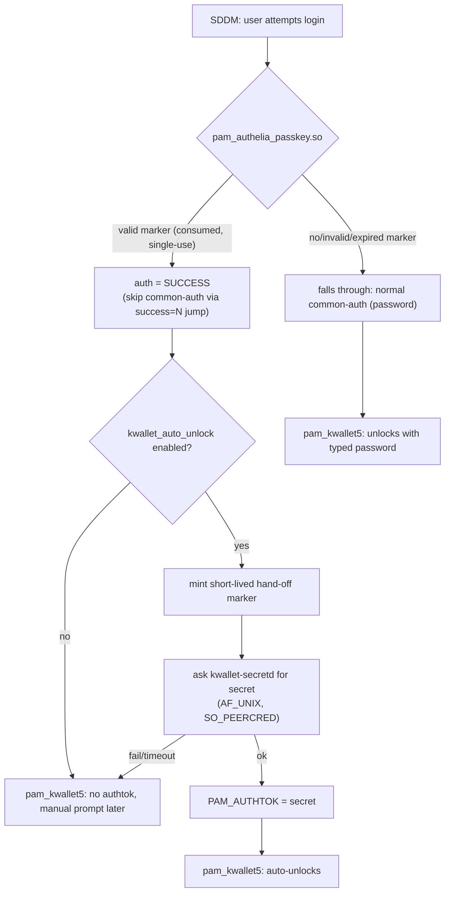
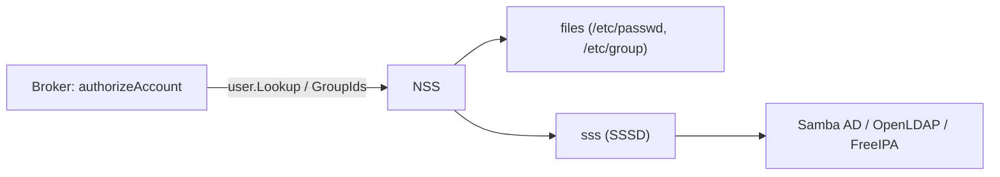

# Architecture

## Core principle: authentication is not identity

```
OIDC (Authelia/Authentik/Keycloak/generic) = AUTHENTICATION PROOF
SSSD/NSS                                   = AUTHORITATIVE UNIX IDENTITY
```

A successful OIDC device-authorization flow proves *who approved the
login on their phone*, per that provider's own userinfo claim - it does
not, by itself, establish which Unix account that identity is allowed
to become. That binding is always the exact-match check described in
"Identity mapping" below, resolved through NSS/SSSD, never through a
UID/GID store this project maintains itself. See `docs/roadmap.md` for
where this principle is headed (a general SDDM/PAM authentication-
mechanism model, not a single-purpose OIDC integration) and
`docs/identity-binding.md` for a concrete gap this principle surfaced
(NSS/local-account shadowing) and its planned fix.

## Components

- **broker** (`src/broker`) - talks to Authelia's OIDC Device Authorization
  endpoints (RFC 8628), renders the QR code, and writes a root-owned,
  single-use, short-TTL approval marker file on success. Never talks to
  PAM. Its local HTTP API (127.0.0.1 only) is not the trust boundary -
  the marker file is.
- **pam_authelia_passkey.so** (`src/pam`) - a native PAM auth module and
  the sole consumer of that marker. On a valid marker it commits to
  `PAM_SUCCESS` unconditionally; optionally (if `kwallet_auto_unlock` is
  configured) it then makes a best-effort attempt to also unlock KWallet,
  which can never turn the already-decided login into a failure.
- **kwallet-secretd** (`src/kwallet-secretd`) - optional. Releases a
  KWallet-unlock secret to the PAM module over a root-only AF_UNIX
  socket, gated by a second, separate, even-shorter-TTL hand-off marker
  that only the PAM module can mint (see below for why).
- **theme patch** (`theme/`) - a diff for `sddm-theme-debian-breeze` adding
  a "Smartphone-Login" action button (alongside Sleep/Restart/Shut Down/
  Other) that opens a right-anchored sidebar with the QR code, matching the
  existing action row's style rather than a floating overlay.

## Why a separate broker process at all?

SDDM's PAM service name is hardcoded in its source
(`src/helper/backend/PamBackend.cpp`): `"sddm"` for a normal login,
`"sddm-greeter"` only for the greeter's own bootstrap session, or
`"sddm-autologin"` for OS-level autologin. It is never configurable from
a theme, `sddm.conf`, or environment variable, which rules out the
"separate PAM service per login method" pattern some other display
managers support. SDDM also only ever asks PAM for a single conversation
step (username + one secret) - see the open upstream issue
[sddm/sddm#2098](https://github.com/sddm/sddm/issues/2098) tracking
native multi-step/async PAM support, which as of this writing has no
linked PR.

Given that, the device-authorization flow (which involves polling over
tens of seconds while a human approves on their phone) cannot happen
inside SDDM's own PAM conversation at all. It has to happen out of band,
in a companion process, with PAM only ever asked a single yes/no question
at the end: "has a marker already been approved for this user?".

## PAM control flow



The `[success=N default=ignore]` extended PAM control syntax is what
makes this safe: `N` is the exact number of lines the local
`@include common-auth` expands to, computed fresh at install time (see
`scripts/enable-pam.sh`), never hardcoded. On success it skips exactly
those `N` lines - never past the following `pam_kwallet5` line - so a
a smartphone/passkey login still reaches `pam_kwallet5` just like a password login
does; on any non-success it changes nothing and password login proceeds
exactly as if this project were not installed.

## Full login flow

```mermaid
sequenceDiagram
    participant User
    participant Theme as SDDM Theme
    participant Broker
    participant Authelia
    participant PAM as pam_authelia_passkey.so
    participant KWallet as kwallet-secretd (optional)

    User->>Theme: click "Smartphone-Login"
    Note over Theme,Broker: username omitted; broker auto-resolves it<br/>when exactly one allowed_user is configured
    Theme->>Broker: POST /start
    Broker->>Authelia: POST /api/oidc/device-authorization
    Authelia-->>Broker: user_code, verification_uri_complete
    Broker-->>Theme: session_id
    Theme->>Theme: render QR from verification_uri_complete
    User->>Authelia: scan QR, WebAuthn/Passkey user verification
    Broker->>Authelia: poll POST /api/oidc/token
    Authelia-->>Broker: access_token (on approval)
    Broker->>Authelia: GET /api/oidc/userinfo (verify username claim)
    Broker->>Broker: write approval marker (root:root, 0600, TTL)
    Theme->>Theme: poll /status, sees "approved" + resolved username
    Note over Theme: idempotent: a stale/duplicate response for a<br/>session that's no longer current is ignored
    Theme->>PAM: sddm.login(resolvedUsername, "", sessionButton.currentIndex)
    PAM->>PAM: consume approval marker, verify TTL
    PAM-->>User: login succeeds
    opt kwallet_auto_unlock=true
        PAM->>KWallet: mint hand-off marker, GET secret (AF_UNIX)
        KWallet-->>PAM: secret (best-effort)
        PAM->>PAM: PAM_AUTHTOK = secret
    end
```

## Duplicate/overlapping flows

Only one flow per user is meant to be "live" at a time. If a new `/start`
arrives for a user who already has an unfinished flow (e.g. the panel was
reopened before the previous attempt finished), the broker marks the prior
flow `cancelled` so its poll loop exits and frees its concurrency slot on
its next iteration - without this, a few overlapping attempts could each
hold one of `max_parallel_flows`' limited slots until their natural 10-
minute deadline, eventually blocking every further login attempt. The
theme's explicit "Abbrechen"/panel-close path calls a dedicated `/cancel`
endpoint for the same reason, rather than relying only on this supersede-
on-next-start behavior. `pixelFlow.open()` in the theme is itself
idempotent - calling it while a flow is already in progress does not start
a second one.

## Identity Awareness (v1.1.0)

`GET /identity?username=X` is a read-only, pre-flow lookup: the theme
calls it as soon as a flow's `targetUsername` is captured (same moment
`/start` is called), so the panel can show *whose* account a flow is
(or would be) for without waiting on the device-authorization round
trip. It runs through the exact same `authorizeAccount()` check
`/start` uses - an unauthorized or unknown username gets the identical
403 with no distinguishing reason, so this endpoint reveals nothing
`/start` doesn't already. It never touches flow/session/rate-limit
state.

The response's `display_name` comes from a fresh NSS/local lookup's
GECOS field (falling back to the plain username if empty) and
`account_source` echoes the server's own `local`/`nss` policy setting -
both already-trusted, server-side-resolved values. This is deliberately
**not** where `resolvedUsername` (the OIDC-claim-derived identity
`pollAndDecide` binds against for the actual login decision) comes from
- an unauthenticated claim is never presented as a trustworthy "whose
account is this" answer, only ever checked against the already-bound
`targetUsername` after a real approval.

The theme resolves an avatar for the identity header the same way: by
matching `targetUsername` against SDDM's own `userModel` (the exact
model backing the main account list), never a second/independent
avatar source. An NSS-only account SDDM's own list doesn't enumerate
simply gets no avatar match - the panel falls back to a generic
identity icon rather than guessing.

## Smart QR UX (v1.2.0)

`flowState.ExpiresAt` (exposed as `expires_at` in `/status`) is the
provider's own RFC 8628 `expires_in` deadline, captured once at
`/start` time - a pure UX value the theme uses to render a live local
countdown and progress bar, recomputed client-side every second rather
than polling the broker just to animate one. It is never itself an
expiry *authority*: `pollAndDecide`'s own independently-computed
deadline (see "Upstream rate limiting" below) remains the only thing
that actually transitions a flow to `expired` - the two happen to track
the same underlying `expires_in` value, but the client-side countdown
reaching zero triggers nothing by itself, it just stops looking
accurate for the second or two until the next real `/status` poll
catches up.

QR codes are rendered at a fixed `qrPixelSize` (512px) with
`qrcode.High` error correction (25% redundancy budget) rather than the
library's small default size and `Medium` (15%) correction - a
higher-resolution source lets the QML `Image` (already `smooth: false`)
downscale to the panel's ~220-260px display size instead of upscaling a
small PNG, and the extra error-correction budget trades a slightly
denser code for materially better real-world scan success against a
phone camera's glare/angle/partial obstruction.

## Service/Connection UX (v1.3.0)

`pixelFlow.connectionState` is deliberately a separate property from
`pixelFlow.state` (flow *progress*: idle/starting/waiting/approved/...):
it answers "is the broker/upstream actually reachable right now", with
exactly six values - `ready`, `connecting`, `waiting`, `rate_limited`,
`offline`, `error` - each with fixed, generic German wording (a status
chip: colored dot + short label, never color alone) that never names a
hostname, HTTP status code, or OIDC/LDAP term. Those details exist only
in the broker's own log (`journalctl -u sddm-authelia-passkey-broker`,
or `SECURITY:`-tagged lines specifically via the admin CLI's
`audit-log`), never in the greeter.

`offline` is the one genuinely new failure mode this introduces
detection for: `xhr.status === 0` on either the initial `/start` POST
or an in-flight `/status` poll means a real network-level failure (no
HTTP response at all - e.g. the broker process isn't running), distinct
from any 4xx/5xx the broker itself returned. A transient offline poll
never tears the flow down by itself - `pixelPollTimer` just keeps
retrying on its normal interval, and a later successful poll clears the
indicator back to `waiting` automatically.

### A single open QR code is one device flow, not repeated login attempts

Authelia's own token-endpoint rate limiter (`internal/middlewares/rate_limiting.go`
as of 4.39.23) periodically returns HTTP 429 to the broker's normal
RFC 8628 polling - confirmed live against the project's real Authelia
instance, with observed `Retry-After` delays ranging from under a
minute up to roughly 55 minutes under this session's own repeated
testing traffic. This is expected, ordinary behavior for **one** open
device flow, not a consequence of a user attempting to log in multiple
times - `checkAndReserve`'s local per-user start-limiter (a completely
separate mechanism, gating `/start` itself) is the only thing that
actually represents repeated login *attempts*.

The broker's own classification of this was already correct before the
UI wording fix below: `rateLimitDecision` (see its doc comment) honors
`Retry-After`, backs off without busy-looping, and gives up cleanly if
the required wait would exceed the flow's own remaining lifetime -
`pollAndDecide` never counts a rate-limited, expired, or
otherwise-ambiguous/infrastructure outcome as an authentication
failure (`releaseNeutral` in every such case; only a genuine
`access_denied` or username mismatch sets `releaseAuthFailure`). What
was wrong was purely presentational: the QML theme labeled all of
this "Zu viele Anmeldeversuche" ("too many login attempts"), which is
backwards - it describes the *user's* behavior, not the *broker's*
polling being throttled. Fixed by:

- **Still pending, upstream momentarily throttling polls**
  (`resp.rate_limited` while `resp.status === "pending"`): reworded to
  "Der Anmeldedienst wartet derzeit mit weiteren Statusabfragen. Bitte
  kurz warten." - never "Zu viele Anmeldeversuche".
- **The flow can no longer succeed** - RFC 8628 `expired`, the
  rate-limit-give-up case (`errorFlow(fs, "rate_limited")` when the
  required wait exceeds the remaining flow lifetime), and
  `temporarily_unavailable` (too many ambiguous/infrastructure errors
  in a row) - all three now collapse to the exact same user-facing
  treatment as plain expiry: `state = "expired"`, "QR-Code
  abgelaufen." + the existing "Neuen Code anfordern" retry button. The
  broker's log keeps the precise distinct reason for diagnosis; the
  greeter doesn't need to distinguish them for the user, and showing
  three different phrasings for what is, from the user's perspective,
  the identical "this code doesn't work anymore, get a new one"
  outcome would only add confusion.

## Responsive Greeter (v1.4.0)

`root.pixelOverlayLayout` switches the Smartphone-Login panel between
exactly one of two layouts - never both, never a hybrid state - purely
a geometry change; `pixelFlow`'s own state machine is completely
unaware of which one is active:

- **Sidebar** (the default): right-anchored,
  `root.pixelSidebarWidth` (`Math.max(320, Math.min(420, root.width *
  0.24))`) wide, full height, slides in horizontally. `mainStack`'s
  `rightMargin` and the clock's centering both narrow to make room for
  it.
- **Overlay** (below the breakpoint): a centered, **size-capped** modal
  card - never full-screen - `Math.min(parent.width - 4*gridUnit,
  420)` wide and `Math.min(parent.height - 6*gridUnit, 620)` tall,
  rounded corners, sliding up from off-screen to vertically centered.
  A dedicated `pixelOverlayScrim` (a separate `Rectangle`, `z: 199`,
  just below the card's own `z: 200`) covers the full screen behind
  the card with a semi-transparent dim, and `loginScreenRoot.enabled`
  (the `MouseArea` wrapping the password field, user list and action
  row) is bound to `!(root.pixelOverlayLayout && pixelPanel.open)` -
  Qt Quick disabling an `Item` disables mouse, keyboard and focus for
  it and every child, so the greeter behind the overlay is dimmed
  *and* genuinely non-interactive/non-focusable, not just visually
  covered. The scrim's own `MouseArea` absorbs any remaining input but
  deliberately does not close the panel on click - only Escape or the
  Cancel button do, so a stray tap can't discard an in-progress flow.
  `mainStack`/clock are **not** narrowed or recentered in this layout,
  since the card floats on top rather than permanently shrinking the
  main area.

**Breakpoint**: derived, not a fixed constant -
`pixelOverlayLayout: width < (pixelSidebarWidth +
pixelMainAreaMinWidth)` (`pixelMainAreaMinWidth = 560`), i.e. the
overlay only activates once the sidebar and a usably-wide main login
column genuinely wouldn't fit side by side, rather than at an
arbitrary screen-size cutoff. `root.width`/`height` are QtQuick
logical units - already DPI-independent, since Qt divides out the
platform's device pixel ratio before these bindings see a number - so
this is correct unchanged across 100/125/150/200/250% scale factors,
with no separate HiDPI branch needed.

Both layouts share the exact same `pixelPanel.open` single-source-of-
truth, the same `Keys.onEscapePressed`/cancel button, and the same
inner `ColumnLayout` content (identity header, QR/countdown, alternate
code, connection-status chip) unchanged - only the outer
position/size/slide-axis/scrim differs.

**Multi-monitor**: SDDM already instantiates one independent QML scene
per screen (the existing `Repeater { model: screenModel }` driving the
wallpaper). Each screen's `Main.qml` instance has its own `root.width`,
so `pixelOverlayLayout` is evaluated independently per screen with no
additional code needed - a narrow secondary display gets the overlay
layout even if the primary display is wide enough for the sidebar, and
vice versa.

**HiDPI**: all of this project's own sizing is expressed in
`Kirigami.Units` (already DPI-aware) or plain numbers interpreted as
QML's own logical-pixel coordinate space, which Qt itself scales to
physical pixels via the platform's normal HiDPI handling - no
project-specific DPI detection was added or is needed.

**Long names/translations**: the identity header's display name and
username labels already `elide: Text.ElideRight` with
`maximumLineCount: 1` (v1.1.0); the "Verzeichniskonto" badge and
connection-status chip size to their own (short, fixed) text via
`implicitWidth`, so longer translated strings simply grow the badge
rather than clipping.

## Compatibility Theme Accessibility 2.0 (v1.5.0)

Every custom element this project adds to the panel now carries
explicit `Accessible` attached properties (`import QtQuick` already
provides these, no extra import needed) - see `docs/accessibility.md`
for the full list and rationale. Two deliberate patterns worth calling
out:

- **Role follows layout, not a fixed value**: `pixelPanel`'s
  `Accessible.role` is `Accessible.Dialog` in overlay layout (modal -
  the rest of the greeter is dimmed and disabled behind it, see
  "Responsive Greeter" above) and `Accessible.Pane` in sidebar layout
  (not modal - the rest of the greeter stays reachable). A screen
  reader should describe the actual interaction model, not a value
  that's only correct in one of the two layouts.
- **Decorative duplicates are ignored, not named**: the identity
  avatar image and the connection-status chip's color dot each sit
  right next to a text label saying the same thing. Giving them their
  own `Accessible.name` would double-announce the same information;
  `Accessible.ignored: true` is the correct fix, not a redundant name.

This is reviewed against the Qt Quick `Accessible` API and Qt Quick
Controls conventions, not verified against a running screen reader
(AT-SPI/Orca) - see `docs/accessibility.md`'s "What has not been
specifically verified" section.

## Native Theme Accessibility Hardening (v1.12.0)

The independent Native Theme applies accessibility at the presentation
boundary only. Authentication authority remains entirely unchanged.

The Smartphone panel's accessible role follows the v1.11 responsive
layout: Dialog when the panel is modal, Pane when it is a sidebar.
Account selection is represented as a List containing selectable
ListItem objects. Connection status and critical flow states have
explicit status/alert semantics, while the QR card has a textual
description pointing at the device-code alternative.

Decorative duplicate content such as account avatars and status-color
dots is removed from the accessibility tree. Native Qt Quick controls
retain their standard keyboard behaviour while password/session/layout
controls gain explicit accessible names.

Focus transitions are deterministic: initial login focus remains on the
password field, manual-account mode moves focus to username entry, and
opening Smartphone-Login moves focus into the panel. Returning from the
panel restores the password path.

No accessibility property is consulted by PAM, the broker,
SmartphoneFlowController, approval-marker handling or `sddm.login()`.
Accessibility therefore cannot create an alternative authentication
success path.

## Error/Recovery UX (v1.6.0)

Every place `Main.qml` sets `pixelFlow.state` to `"error"` or
`"expired"` also sets `pixelFlow.errorKind` (a machine-readable cause,
never shown directly - `statusText` stays the free-form sentence) and
calls `armRetryCooldown(seconds)`, except the one case where no
request was ever sent (`errorKind: "no_account"` - selecting an
account first is the only thing that helps, so there's nothing to
debounce):

| `errorKind`        | Cause                                          | Cooldown |
|---------------------|------------------------------------------------|----------|
| `offline`            | `/start` unreachable (`xhr.status === 0`)      | 4s |
| `rate_limited`        | broker's own local per-user start-limiter (429) | 10s |
| `not_authorized`      | `/start` 403 - this account isn't eligible      | 3s |
| `start_failed`         | any other non-200 from `/start`                | 4s |
| `expired`               | RFC 8628 deadline / upstream give-up (collapsed, see "Flow outcome versus local failure lockout") | 2s |
| `denied`                 | `access_denied` or an unrecognized broker error | 4s |
| `handoff_failed`          | empty resolved username / invalid session index (should never happen) | 4s |

The cooldown (`pixelFlow.retryAvailableAt`/`retryCooldownRemaining`,
ticked by `pixelRetryCooldownTimer`) is a **UI courtesy debounce only**
- it disables the retry/new-code button for a few seconds so a stray
double-click or repeated mashing can't hammer the broker's `/start`
endpoint, and shows a countdown in the button's own label. It never
touches Authelia's real rate limiting (see "Upstream rate limiting"
below) and is not itself a security control - a modified/replacement
theme skipping it changes nothing about what the broker or Authelia
actually enforce.

`errorKind === "not_authorized"` additionally shows a small hint
pointing at the always-available password field (see
`docs/accessibility.md`'s "password path is always available"
guarantee) - retrying doesn't change whether this account is eligible
for Smartphone-Login, so the panel points at the path that's
guaranteed to still work instead of just repeating the same failure
sentence with nothing actionable.

## Login Transition (v1.7.0)

`root.pixelLoginTransitioning` (`pixelFlow.state === "approved" ||
"logging_in"`) covers the brief window between a confirmed smartphone
approval and `sddm.login()` actually being called - the "Bestätigt"
checkmark beat (`pixelApprovedTimer`, 700ms), then "Anmeldung
läuft…" up to the real session hand-off. Previously the rest of the
greeter only dimmed/stopped accepting input while the overlay card was
open (narrow displays only) - now it does so during this window too,
in **both** layouts:

- `loginScreenRoot.enabled` (password field, user list, action row)
  also goes `false` during this window, on top of its existing overlay
  condition - the same mechanism as the overlay's input-blocking (see
  "Responsive Greeter" above), just gated on a different condition.
- `pixelOverlayScrim` also dims during this window in sidebar layout
  too (more lightly - 0.35 vs. the overlay's 0.55 - since the sidebar
  panel itself stays fully legible either way; this is a purely visual
  echo of the functional block above, not a second mechanism).
- The QR panel's `QQC2.BusyIndicator` (previously only visible while
  `state === "starting"`) now also spins through `"logging_in"`, so
  there's continuous progress feedback right up to the actual switch -
  the QR card (including its "approved" checkmark) is already hidden
  by then, so nothing else fills that gap.

Deliberately unchanged: the password login path itself. Making the
same visual treatment apply there would mean modifying stock
SDDM/Breeze password-handling code rather than this project's own
additive elements, which is a materially different risk profile from
everything else in this patch - out of scope here.

## Upstream rate limiting

Authelia's own token-endpoint abuse limiter (`server.endpoints.rate_limits
.openid_connect_token`, on by default) sits in front of the OAuth2 handler
and can reject a poll with HTTP 429, independently of the device flow's own
`interval`/`slow_down` semantics - a burst of overlapping flows (several
real logins, or heavy manual testing) can trigger it purely through normal
RFC 8628 polling, with nobody actually retrying anything abusively. The
broker never weakens or reconfigures this limit; `pollToken` detects a 429,
reads `Retry-After` if present (bounded, RFC 7231 seconds-or-HTTP-date
form), and `pollAndDecide` treats it like a spec `slow_down` for backoff
purposes - except the resulting wait is also checked against the flow's own
remaining lifetime: if Authelia's `Retry-After` would land at or past the
flow's deadline, the flow fails closed (`rate_limited`) instead of quietly
running out the clock.

Critically, this is a UX/diagnostic concern, not an authentication
decision: `flowState.RateLimited`/`RetryAfterSeconds` are pure hints
surfaced over `/status` so the theme can distinguish "Authelia's limiter is
holding this poll" from "still waiting on the user" instead of showing an
indistinguishable "Warte auf Bestätigung…" for both. A rate-limited flow
can never be approved and never writes an approval marker - `fs.Status`
only ever becomes `"approved"` via the same `outcomeOK` branch as before,
which a rate-limited poll never reaches by construction (see
`rateLimitDecision`, `pollAndDecide` in `src/broker/main.go`).

## Multi-user readiness

`allowed_users` supports more than one entry, and the smartphone/passkey
flow is bound to whichever local account SDDM itself currently has
selected - `pixelFlow.sddmSelectedUsername` in the theme tracks the
avatar list's highlighted user (or the manually typed username when
that prompt is showing instead) via SDDM's own `userList`/`userNameInput`,
so there is no second, independent user database. See
`docs/validated-environment.md` for what has actually been exercised
end-to-end (still one real production/lab identity; multi-user proof
beyond that is via real local PAM test accounts and unit-level identity
mocks, not two real people - see `KNOWN_LIMITATIONS`).

**Identity binding.** Three distinct usernames are involved in a single
flow, and they must agree by the definition below - anything else is a
`DENY`, not a best-effort guess:

- `REQUESTED_LOCAL_USER` - the local account the flow was started for.
  Either the `username` query parameter on `/start` (validated against
  `allowed_users`), or, only when `allowed_users` has exactly one entry,
  that sole entry (a convenience fallback, not the long-term model - see
  below). Stored as `flowState.Username` for the lifetime of the flow,
  and independently re-derived by PAM via `pam_get_user()` (i.e. from
  SDDM's own login prompt) when a marker is consumed.
- `AUTHENTICATED_AUTHELIA_USER` - the `authelia.pam.username` claim from
  Authelia's `/api/oidc/userinfo` response for the access token the
  device flow produced (`verifyUserinfo` in `src/broker/main.go`).
- `BOUND_LOCAL_USER` - the mapping rule is **exact string match**:
  `pollAndDecide` refuses (`fail(fs, "username mismatch")`, logged at
  `SECURITY` level) unless `AUTHENTICATED_AUTHELIA_USER ==
  REQUESTED_LOCAL_USER`. No fuzzy/heuristic mapping exists or is
  planned; a future explicit static mapping table (Authelia username ->
  local username) is conceivable, but exact match is and remains the
  default.

**Per-user isolation, already true today:**

1. Rate limiting (`limiterFor`), the concurrency cap, and failure
   lockout are all keyed by username (`limiters map[string]*userLimiter`).
2. `supersedePriorFlow`/`lastSessionForUser` are keyed by username - a
   new flow for alice can only ever supersede alice's own prior flow,
   never bob's.
3. `/cancel` operates on an unguessable `session_id` (128 bits of
   randomness from `randomHex`), not a username - cancelling one
   session cannot reach another user's session by construction.
4. Approval markers are filed as `approved-<sanitized username>`
   (`writeApprovalMarker`) and consumed by PAM using its own
   independently-obtained username - PAM can structurally never consume
   a marker for a user other than the one it is actually authenticating.
   The marker's content additionally embeds the UID the broker resolved
   via NSS *at flow-start time* (`VERSION=2`/`USERNAME=`/`UID=` fields);
   PAM re-resolves the account fresh via `getpwnam_r` at consumption
   time and requires an exact UID match, so an account deleted and
   recreated (same username, different UID) between approval and
   consumption fails closed instead of being silently trusted.
5. `allowed_users["root"]` is refused outright at config-load time,
   redundant with (not a replacement for) the PAM stack's own
   `pam_succeed_if.so user != root` line.

See `src/broker/multiuser_test.go` for the tests exercising this
isolation directly (parallel alice/bob flows, cross-user
supersede/cancel rejection, multi-entry `allowed_users` parsing).

**Per-user KWallet credentials.** `kwallet-secretd` resolves a distinct
credential per local user (`kwallet_credential_name` is a *prefix*; the
actual file is `<prefix>.<username>`, e.g. `kwallet.secret.alice` - see
`docs/kwallet.md` and `scripts/setup-kwallet-credential.sh`). The
hand-off marker PAM mints after a successful login also carries the
account's UID, and `kwallet-secretd` refuses to release a secret unless
that UID matches what the requesting PAM process claims - a request
naming "alice" cannot be satisfied by a hand-off marker minted for any
other account, even under a race.

**The single-allowed-user auto-resolution is a broker-level convenience
fallback, not what the theme relies on.** The theme itself always sends
an explicit `username` (SDDM's own currently-selected account - see
below), so this API-level fallback (omit `username` when
`allowed_users` has exactly one entry) mainly exists for direct API
callers/testing. With more than one entry and no `username`, `/start`
still refuses (`403`) rather than guessing - never username enumeration,
never an implicit choice.

**Flow-to-account binding in the theme.** `pixelFlow.sddmSelectedUsername`
tracks SDDM's own account selection (`mainStack.currentItem.userList
.selectedUser`, or `.userNameInput.text` when the manual-entry prompt is
showing) - SDDM's existing account picker is the only source of truth,
never a second user list. `pixelFlow.targetUsername` is captured from
that once, when a flow starts, and is immutable for the flow's whole
lifetime; if SDDM's selection changes to a different account while a
flow is active, `onSddmSelectedUsernameChanged` cancels it immediately
rather than silently retargeting - a stale `/status` "approved" response
can then never reach `handleApproved` for the newly-selected account,
because `state` is no longer `"waiting"` by the time it would arrive.

## LDAP/Active Directory accounts (NSS)

`account_source=nss` (config-only; `local` remains the default and is
unchanged from v0.1-v0.4) lifts the "must be a literal `allowed_users`
entry" requirement for accounts NSS can resolve - the same mechanism any
other PAM-integrated login path already relies on, not a new one this
project invents:



**The broker never speaks LDAP, Kerberos, or any directory protocol
itself, and never caches a directory credential.** It only calls
`os/user.Lookup`/`(*user.User).GroupIds` - the same libc NSS entry points
(`getpwnam_r`, `getgrouplist`) `login`, `sshd`, or `sudo` would use. This
binary is built cgo-enabled (`debian/rules`, external linking already
required for the PAM hardening flags) specifically so these calls go
through the *system's* NSS/`/etc/nsswitch.conf`, not a pure-Go fallback
that would only ever see `/etc/passwd`. Whatever `passwd:`/`group:` lines
in `nsswitch.conf` resolve to - `files`, `sss`, or both - is exactly what
this project sees, nothing more.

**`authorizeAccount` (`src/broker/main.go`) is the single gate**, called
fresh on every `/start`, never cached:

1. `local` mode: username must be a literal `allowed_users` entry -
   identical to every prior release.
2. `nss` mode: the account must resolve via NSS at all (a lookup error -
   SSSD down, LDAP unreachable, truly unknown user - fails closed, never
   "assume allowed"); must not be `root` (checked by both UID `0` *and*
   name, so a second account sharing UID 0 can't slip through either);
   must not be in `deny_users` (which always implicitly contains `root`
   regardless of config); must have UID `>= minimum_uid`; and, if
   `allowed_groups` is non-empty, must be a member (via a fresh
   `GroupIds()` call, resolved against `allowed_groups` by name, not
   GID number, since GID numbering is directory-specific) of at least
   one of them. A non-empty `allowed_users` in this mode is then an
   *additional*, not alternative, restriction.

**Everything downstream of that gate is unchanged.** The UID resolved
here is embedded in the v2 approval marker exactly as before, and PAM
re-resolves it fresh via `getpwnam_r` at consumption time - an NSS/LDAP
account renamed, deleted, or given a different UID between approval and
login fails exactly the same way a local account would (see "Multi-user
readiness" above). The `AUTHENTICATED_AUTHELIA_USER ==
REQUESTED_LOCAL_USER` exact-match check in `pollAndDecide` is completely
unaware of `account_source` - identity binding does not care where the
account came from. Per-user rate limiting, flow supersession, and
cancellation are keyed by username exactly as before, so an NSS-resolved
account gets the same per-user isolation a local one does.

**What this project deliberately does not do**: implement its own LDAP
client, its own directory credential cache, or its own group-membership
cache. SSSD (or whatever NSS module is configured) already solves
caching, offline behavior, and connection pooling correctly; duplicating
that here would only add a second, likely-inconsistent source of truth.
A host without SSSD configured (or with `account_source=local`, the
default) is entirely unaffected - this is opt-in, not a new requirement.

## Provider abstraction

`provider_kind` (default `authelia`, unchanged from v0.1-v0.6) selects
which OIDC Device Authorization Grant (RFC 8628) provider the broker
talks to. `provider_kind=oidc` supports any standards-compliant provider
that publishes an OIDC discovery document advertising
`device_authorization_endpoint` - Keycloak, Authentik, or any other
generic OIDC Provider - via `oidc_discovery_url`/`oidc_identity_claim`
(`src/broker/provider.go`).

**No provider-specific logic ever exists in the QML theme** - it only
ever talks to this broker's own `127.0.0.1:7899` API exactly as before,
completely unaware of which provider (or even whether Authelia or a
generic OIDC provider) is configured. This is unaffected by
`provider_kind` by construction, not by convention.

**Capability detection** is the discovery document itself: if it doesn't
advertise `device_authorization_endpoint`, `token_endpoint`, and
`userinfo_endpoint`, the broker refuses to start rather than guess at a
conventional path - the same fail-closed philosophy as everywhere else
in this project.

**Identity mapping** stays exactly the model described above
(`REQUESTED_LOCAL_USER`/`AUTHENTICATED_..._USER`/`BOUND_LOCAL_USER`,
exact string match, no fuzzy mapping) - only which userinfo claim
supplies `AUTHENTICATED_..._USER` changes: Authelia's own
`authelia.pam.username`, or `oidc_identity_claim` (default
`preferred_username`) for a generic OIDC provider.

**Deliberately not a Go `interface` threaded through every call site.**
The existing `deviceAuthorize`/`pollToken`/`verifyUserinfo` functions -
and every test exercising them directly - are completely unmodified;
`providerDeviceAuthorize`/`providerPollToken`/`providerVerifyIdentity`
are the only new call sites (used by `handleStart`/`pollAndDecide`
instead of calling the Authelia-specific functions directly), and they
simply dispatch to those unchanged functions unless `provider_kind=oidc`
is explicitly configured. This keeps the already-proven Authelia code
path's risk at zero.

**Validated** (mock, all releases through v2.0.0): the generic OIDC path
end-to-end (device-authorization, token polling including rate-limit
passthrough, and identity extraction with both the default and a custom
claim name) against a mock server shaped like Keycloak's real endpoint
layout (`/protocol/openid-connect/{auth/device,token,userinfo}`), and
discovery capability detection refusing a provider that doesn't
advertise `device_authorization_endpoint`.

**Validated for real (v2.1.0)**: a real, live Authentik instance
(isolated lab application, Device Code grant, public client, RS256),
end-to-end through a real Samba AD account resolved via
`account_source=nss`/SSSD - discovery, issuer verification, device
authorization, RFC 8628 `authorization_pending` polling, and a real
approved session with a real QR code rendered. This uncovered and fixed
a real pre-existing gap (see "verification_uri trust model" below) that
the mock-based tests above never exercised, because they call
`providerDeviceAuthorize`/`providerPollToken`/`providerVerifyIdentity`
directly and never went through the HTTP-handler-level
`validateVerificationURI` check at all.

**Still not validated**: a real, live Keycloak instance - none exists in
this environment. Real physical FIDO2/U2F hardware similarly remains
untested (see `docs/fido2.md`) for the same reason: no device
available, not a fabricated pass.

### `verification_uri` trust model

The device-authorization response's `verification_uri`/
`verification_uri_complete` is the one part of that response this
broker renders as a QR code and hands to the user - so its origin must
be pinned to something trustworthy, while its path/query stays whatever
shape that specific provider actually uses (Authelia's
`/consent/openid/device-authorization?user_code=...`, Authentik's
`/device?code=...`, Keycloak's own shape, etc. - RFC 8628 does not
mandate one, and this broker does not try to guess which query
parameter carries the user code).

`src/broker/verification_uri.go` implements this as: the discovery
document's own `issuer` (verified to match the configured
`oidc_discovery_url` - never trusted merely because it arrived over the
network), `device_authorization_endpoint`, and `authorization_endpoint`
(when present) each contribute a **trusted origin**
(scheme+host+effective-port, case-insensitive host, no
prefix/suffix/substring matching). `token_endpoint` and `jwks_uri`
deliberately do **not** - a provider may run token/key infrastructure on
a separate host from its user-facing pages, and that alone must not
authorize sending a user's browser there. The returned
`verification_uri`'s own origin must be a member of that already-derived
set; nothing about the device-authorization response itself is ever
allowed to expand it. `provider_kind=authelia` keeps its original,
unchanged trust model instead (a single origin from the explicitly
configured `allowed_verification_host` - Authelia mode does no OIDC
discovery at all).

## Native FIDO2/U2F hardware security keys

Optional, opt-in, off by default - see `docs/fido2.md` for the full
design, enrollment/revocation workflow, and PAM stacking detail. In
short: `pam_u2f.so` (Debian package `libpam-u2f`, upstream Yubico
project - never reimplemented by this project) is wired in additively,
ahead of `pam_authelia_passkey.so`, using the same dynamic
`[success=N default=ignore]` skip-count computation already used
throughout this project. A missing device, unenrolled user, or failed
touch/PIN/UV falls through to the smartphone/passkey path and then the
password fallback exactly as if FIDO2 support were not installed -
`pam_u2f` is looked up strictly by the username PAM itself is
authenticating, giving it the same structural cross-user isolation as
every other identity source here.

## Native theme (v1.9.0, experimental)

`theme/native/` is a second, independent SDDM Qt6 theme - an original,
from-scratch implementation, not a variant of the Debian Breeze
compatibility patch above. It is installed alongside (never replacing)
the compatibility theme, is not selected by package install/upgrade,
and does not implement any authentication logic itself: it calls the
same `sddm.login(username, password, sessionIndex)` primitive, so PAM
remains the sole authentication authority exactly as with the
compatibility theme. See `docs/native-theme.md` for what v1.9.0
foundation-level actually covers, and the private roadmap repository's
`NATIVE-THEME-ROADMAP.md` for the full v1.9.0 -> v2.0.0 track
(authoritative wherever older planning conflicts with it).

## Trust boundaries

- The broker's HTTP API is localhost-only and never itself authenticates
  anyone - only the approval marker file does.
- The approval marker is root-owned, 0600, single-use (atomically
  renamed-then-checked before being trusted), and short-TTL.
- `kwallet-secretd`'s socket is root-only (`0600`) at the filesystem
  level and additionally checks `SO_PEERCRED` for uid 0, and only ever
  releases a secret in response to a *second*, separate hand-off marker
  that only the already-successful PAM module can mint - it never reads
  or consumes the login-approval marker itself, so there is no
  double-consumer race between the login decision and the secret
  release.
- See `docs/threat-model.md` and `docs/security.md` for the full
  analysis.


### Flow outcome versus local failure lockout

The per-user failure lockout is an authentication-abuse control, not an
availability-error counter. Only explicit authentication denial, including
OAuth `access_denied` or a verified identity mismatch, increments it.
Cancellation, supersession, expiry, HTTP 429, transport/proxy errors and
userinfo infrastructure failures release the concurrency slot neutrally.

HTTP 429 backoff never becomes shorter than the current poll interval and
grows conservatively while throttling continues. Cancellation wakes a poller
even during a long Retry-After wait so stale flows do not retain global
concurrency slots.

## Optional Branding (v1.8.0)

Branding is strictly presentation configuration and does not enter an
authentication trust boundary.

The greeter reads optional values through SDDM's native `theme.conf.user`
configuration interface. Authentication/policy `config.conf` is deliberately
not extended with visual settings.

With no branding settings configured, the v1.7.0 Debian Breeze appearance is
unchanged.

Remote branding assets are not supported. A logo must be an absolute local
file path. Hostname comes from SDDM's own local `sddm.hostName` property;
domain/realm text is explicitly administrator configured and is never inferred
from an OIDC claim.

The installer preserves a safe existing root-owned regular
`theme.conf.user` when rebuilding the additive theme, while refusing symlinks
or non-root-owned override files.

## Native Theme Feature Parity (v1.10.0)

The Native Theme now implements the complete presentation-side Smartphone
Login flow while preserving the existing authentication boundary.

The QML controller talks only to the localhost broker. It captures an
immutable canonical username and SDDM session index when a flow begins.
Every asynchronous callback is bound to both a monotonically increasing
client generation and the broker session ID. Late callbacks from cancelled,
superseded or otherwise stale flows therefore cannot retarget a newer login.

The broker's approved username must exactly match the captured target before
the theme asks SDDM to invoke PAM. The QML response itself is not an
authentication decision; PAM still has to validate and consume the protected
single-use approval marker.

Account switching cancels any active Smartphone flow. Closing or explicitly
cancelling the panel uses the broker's `/cancel` endpoint. A late `/start`
response from an already-invalidated client generation is immediately
cancelled rather than adopted.

The visible expiry countdown is derived from `expires_at` but remains
presentation-only. It does not change authentication state or create extra
broker polls.

Connection state is separate from authentication-flow state. A temporary
local-broker connectivity failure is shown as offline without being
misclassified as an authentication denial. Provider polling throttling is
shown neutrally as a temporary service wait.

The password path remains independent and available throughout the design.

## Native Theme Responsive UX (v1.11.0)

The Native Theme keeps responsive geometry separate from authentication
state through `ResponsiveMetrics.qml`.

The Smartphone panel has exactly one presentation mode at a time:

- a right-side panel when the panel plus a minimum 560-logical-pixel
  login area fit beside each other;
- a centred modal overlay when they do not.

The sidebar width is itself bounded between 480 and 560 logical pixels.
The breakpoint is therefore derived from current available space rather
than from a named monitor resolution.

Short viewports below 700 logical pixels reduce card margins, user-list
height and QR size. Qt Quick logical coordinates remain the source of
truth, so no project-specific DPI or scaling detector is introduced.

Both presentation modes use the same `SmartphoneFlowController`.
Switching layout cannot approve, deny, retry, cancel or otherwise mutate
authentication state. On overlay layouts the existing scrim disables
interaction with the login card; on sidebar layouts the login card may
remain usable and its existing account-change/password actions continue
to cancel or retarget the active flow safely.

## Native Failure & Recovery UX (v1.14.0)

The Native Theme keeps flow progress and infrastructure presentation
separate.

`state` describes the presentation-side device-flow lifecycle.
`connectionState` describes whether the local broker/upstream path currently
appears ready, waiting, throttled, offline or in error. Authentication
decisions such as `denied` and `not_authorized` are not reclassified as
network failures.

`temporarily_unavailable` is an infrastructure/provider condition and is not
presented as expiry. `rate_limited` is likewise distinct from both expiry and
denial.

The broker remains authoritative for OAuth device-flow lifetime and upstream
poll timing. Its token polling already parses and respects bounded
`Retry-After` values. QML does not reproduce that algorithm. A Native Theme
retry countdown after a local `/start` 429 is only a short client-side retry
guard and must not be interpreted as the upstream Retry-After value.

Malformed HTTP/JSON status polling is treated as infrastructure uncertainty,
not authentication denial. A transient malformed poll may recover on a later
valid status. A structurally valid broker response with no usable `status`
terminates the presentation flow safely, cancels the still-pending broker
session and requires an explicit restart.

After `approved -> logging_in`, an SDDM `loginFailed` invalidates the QML
flow generation and clears old session/QR presentation state. The prior
approval is never replayed automatically.

QR image failure is presentation-only when the broker still supplied a
device code and verification address. The explicit alternate path remains
available, as does password login.

## Capability negotiation (v2.4.0, partial)

A read-only, unauthenticated `GET /capabilities` broker endpoint reports
`oidc_ready` (fresh, throttled reachability check against the
configured identity provider), `fido2_wired` (whether `pam_u2f.so` is
actually present in `/etc/pam.d/sddm`), and `smartcard_ready` (always
`false` - not implemented). The native theme polls it independently of
any login flow and uses it only to drive a small informational hint,
never a flow-control or security decision - see
`docs/capability-negotiation.md` for the full scope and what remains
explicitly out of scope (a generic mechanism-selection framework,
capability-driven mechanism offering, dedicated hardware-key/smartcard
UI states).

## Failure and recovery policy (v2.7.0)

Every broker->identity-provider HTTP call (discovery, device-
authorization, token, userinfo) is bounded by a single
`providerHTTPClient` with a 15-second timeout - a real gap fixed in
v2.7.0 (previously none of these calls had any timeout, so a
non-responding provider could hang the calling goroutine forever,
preventing `pollAndDecide`'s own bounded-retry-then-fail-closed logic
from ever running). See `docs/failure-policy.md` for the full,
per-case `FAIL_CLOSED`/`SAFE_LOCAL_FALLBACK` decision matrix, including
real VM124 findings on SSSD's cache resilience and broker-restart-mid-
flow safety.

## Transaction-bound remote approval (v2.8.0)

`pollAndDecide` re-checks `fs.cancelled` immediately after every
`providerPollToken` call returns, before processing that poll's result
- a real gap fixed in v2.8.0 (a supersede landing while a poll request
was genuinely in flight could otherwise still let that flow's approval
succeed). The approval marker (`writeApprovalMarker`/
`buildApprovalMarkerToken`) also carries explicit bound context
(`SESSION_ID`/`IDENTITY_SOURCE`/`PROVIDER`/`HOSTNAME`/
`REQUESTED_ACTION`) alongside the existing security-critical fields,
backward compatible with the unchanged PAM consumer. See
`docs/transaction-binding.md` for the full verification of every named
transaction-binding security requirement.

## Mechanism selection (v2.9.0, first real increment)

The smartphone/EIdP button is now disabled (with a visible reason)
whenever `oidc_ready` is false, and the FIDO2-available hint moved to
the main login screen - a real, narrow first step of v3.0.0's generic
mechanism-selection vision, not the full framework. See
`docs/mechanism-selection.md` for what this does and does not cover,
including why hardware-key login has no selectable UI action to bind
(`pam_u2f.so` tries silently ahead of both other paths in PAM).
