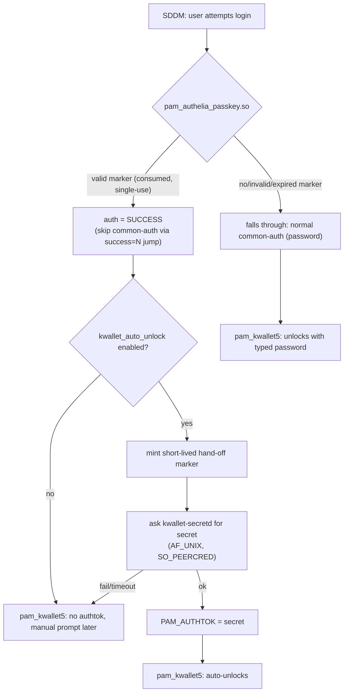
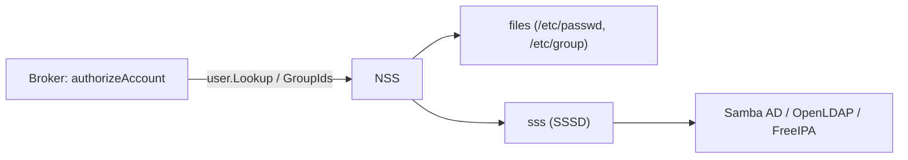

# Architecture

## Components

- **broker** (`src/broker`) - talks to Authelia's OIDC Device Authorization
  endpoints (RFC 8628), renders the QR code, and writes a root-owned,
  single-use, short-TTL approval marker file on success. Never talks to
  PAM. Its local HTTP API (127.0.0.1 only) is not the trust boundary -
  the marker file is.
- **pam_authelia_passkey.so** (`src/pam`) - a native PAM auth module and
  the sole consumer of that marker. On a valid marker it commits to
  `PAM_SUCCESS` unconditionally; optionally (if `kwallet_auto_unlock` is
  configured) it then makes a best-effort attempt to also unlock KWallet,
  which can never turn the already-decided login into a failure.
- **kwallet-secretd** (`src/kwallet-secretd`) - optional. Releases a
  KWallet-unlock secret to the PAM module over a root-only AF_UNIX
  socket, gated by a second, separate, even-shorter-TTL hand-off marker
  that only the PAM module can mint (see below for why).
- **theme patch** (`theme/`) - a diff for `sddm-theme-debian-breeze` adding
  a "Smartphone-Login" action button (alongside Sleep/Restart/Shut Down/
  Other) that opens a right-anchored sidebar with the QR code, matching the
  existing action row's style rather than a floating overlay.

## Why a separate broker process at all?

SDDM's PAM service name is hardcoded in its source
(`src/helper/backend/PamBackend.cpp`): `"sddm"` for a normal login,
`"sddm-greeter"` only for the greeter's own bootstrap session, or
`"sddm-autologin"` for OS-level autologin. It is never configurable from
a theme, `sddm.conf`, or environment variable, which rules out the
"separate PAM service per login method" pattern some other display
managers support. SDDM also only ever asks PAM for a single conversation
step (username + one secret) - see the open upstream issue
[sddm/sddm#2098](https://github.com/sddm/sddm/issues/2098) tracking
native multi-step/async PAM support, which as of this writing has no
linked PR.

Given that, the device-authorization flow (which involves polling over
tens of seconds while a human approves on their phone) cannot happen
inside SDDM's own PAM conversation at all. It has to happen out of band,
in a companion process, with PAM only ever asked a single yes/no question
at the end: "has a marker already been approved for this user?".

## PAM control flow



The `[success=N default=ignore]` extended PAM control syntax is what
makes this safe: `N` is the exact number of lines the local
`@include common-auth` expands to, computed fresh at install time (see
`scripts/enable-pam.sh`), never hardcoded. On success it skips exactly
those `N` lines - never past the following `pam_kwallet5` line - so a
a smartphone/passkey login still reaches `pam_kwallet5` just like a password login
does; on any non-success it changes nothing and password login proceeds
exactly as if this project were not installed.

## Full login flow

```mermaid
sequenceDiagram
    participant User
    participant Theme as SDDM Theme
    participant Broker
    participant Authelia
    participant PAM as pam_authelia_passkey.so
    participant KWallet as kwallet-secretd (optional)

    User->>Theme: click "Smartphone-Login"
    Note over Theme,Broker: username omitted; broker auto-resolves it<br/>when exactly one allowed_user is configured
    Theme->>Broker: POST /start
    Broker->>Authelia: POST /api/oidc/device-authorization
    Authelia-->>Broker: user_code, verification_uri_complete
    Broker-->>Theme: session_id
    Theme->>Theme: render QR from verification_uri_complete
    User->>Authelia: scan QR, WebAuthn/Passkey user verification
    Broker->>Authelia: poll POST /api/oidc/token
    Authelia-->>Broker: access_token (on approval)
    Broker->>Authelia: GET /api/oidc/userinfo (verify username claim)
    Broker->>Broker: write approval marker (root:root, 0600, TTL)
    Theme->>Theme: poll /status, sees "approved" + resolved username
    Note over Theme: idempotent: a stale/duplicate response for a<br/>session that's no longer current is ignored
    Theme->>PAM: sddm.login(resolvedUsername, "", sessionButton.currentIndex)
    PAM->>PAM: consume approval marker, verify TTL
    PAM-->>User: login succeeds
    opt kwallet_auto_unlock=true
        PAM->>KWallet: mint hand-off marker, GET secret (AF_UNIX)
        KWallet-->>PAM: secret (best-effort)
        PAM->>PAM: PAM_AUTHTOK = secret
    end
```

## Duplicate/overlapping flows

Only one flow per user is meant to be "live" at a time. If a new `/start`
arrives for a user who already has an unfinished flow (e.g. the panel was
reopened before the previous attempt finished), the broker marks the prior
flow `cancelled` so its poll loop exits and frees its concurrency slot on
its next iteration - without this, a few overlapping attempts could each
hold one of `max_parallel_flows`' limited slots until their natural 10-
minute deadline, eventually blocking every further login attempt. The
theme's explicit "Abbrechen"/panel-close path calls a dedicated `/cancel`
endpoint for the same reason, rather than relying only on this supersede-
on-next-start behavior. `pixelFlow.open()` in the theme is itself
idempotent - calling it while a flow is already in progress does not start
a second one.

## Upstream rate limiting

Authelia's own token-endpoint abuse limiter (`server.endpoints.rate_limits
.openid_connect_token`, on by default) sits in front of the OAuth2 handler
and can reject a poll with HTTP 429, independently of the device flow's own
`interval`/`slow_down` semantics - a burst of overlapping flows (several
real logins, or heavy manual testing) can trigger it purely through normal
RFC 8628 polling, with nobody actually retrying anything abusively. The
broker never weakens or reconfigures this limit; `pollToken` detects a 429,
reads `Retry-After` if present (bounded, RFC 7231 seconds-or-HTTP-date
form), and `pollAndDecide` treats it like a spec `slow_down` for backoff
purposes - except the resulting wait is also checked against the flow's own
remaining lifetime: if Authelia's `Retry-After` would land at or past the
flow's deadline, the flow fails closed (`rate_limited`) instead of quietly
running out the clock.

Critically, this is a UX/diagnostic concern, not an authentication
decision: `flowState.RateLimited`/`RetryAfterSeconds` are pure hints
surfaced over `/status` so the theme can distinguish "Authelia's limiter is
holding this poll" from "still waiting on the user" instead of showing an
indistinguishable "Warte auf Bestätigung…" for both. A rate-limited flow
can never be approved and never writes an approval marker - `fs.Status`
only ever becomes `"approved"` via the same `outcomeOK` branch as before,
which a rate-limited poll never reaches by construction (see
`rateLimitDecision`, `pollAndDecide` in `src/broker/main.go`).

## Multi-user readiness

`allowed_users` supports more than one entry, and the smartphone/passkey
flow is bound to whichever local account SDDM itself currently has
selected - `pixelFlow.sddmSelectedUsername` in the theme tracks the
avatar list's highlighted user (or the manually typed username when
that prompt is showing instead) via SDDM's own `userList`/`userNameInput`,
so there is no second, independent user database. See
`docs/validated-environment.md` for what has actually been exercised
end-to-end (still one real production/lab identity; multi-user proof
beyond that is via real local PAM test accounts and unit-level identity
mocks, not two real people - see `KNOWN_LIMITATIONS`).

**Identity binding.** Three distinct usernames are involved in a single
flow, and they must agree by the definition below - anything else is a
`DENY`, not a best-effort guess:

- `REQUESTED_LOCAL_USER` - the local account the flow was started for.
  Either the `username` query parameter on `/start` (validated against
  `allowed_users`), or, only when `allowed_users` has exactly one entry,
  that sole entry (a convenience fallback, not the long-term model - see
  below). Stored as `flowState.Username` for the lifetime of the flow,
  and independently re-derived by PAM via `pam_get_user()` (i.e. from
  SDDM's own login prompt) when a marker is consumed.
- `AUTHENTICATED_AUTHELIA_USER` - the `authelia.pam.username` claim from
  Authelia's `/api/oidc/userinfo` response for the access token the
  device flow produced (`verifyUserinfo` in `src/broker/main.go`).
- `BOUND_LOCAL_USER` - the mapping rule is **exact string match**:
  `pollAndDecide` refuses (`fail(fs, "username mismatch")`, logged at
  `SECURITY` level) unless `AUTHENTICATED_AUTHELIA_USER ==
  REQUESTED_LOCAL_USER`. No fuzzy/heuristic mapping exists or is
  planned; a future explicit static mapping table (Authelia username ->
  local username) is conceivable, but exact match is and remains the
  default.

**Per-user isolation, already true today:**

1. Rate limiting (`limiterFor`), the concurrency cap, and failure
   lockout are all keyed by username (`limiters map[string]*userLimiter`).
2. `supersedePriorFlow`/`lastSessionForUser` are keyed by username - a
   new flow for alice can only ever supersede alice's own prior flow,
   never bob's.
3. `/cancel` operates on an unguessable `session_id` (128 bits of
   randomness from `randomHex`), not a username - cancelling one
   session cannot reach another user's session by construction.
4. Approval markers are filed as `approved-<sanitized username>`
   (`writeApprovalMarker`) and consumed by PAM using its own
   independently-obtained username - PAM can structurally never consume
   a marker for a user other than the one it is actually authenticating.
   The marker's content additionally embeds the UID the broker resolved
   via NSS *at flow-start time* (`VERSION=2`/`USERNAME=`/`UID=` fields);
   PAM re-resolves the account fresh via `getpwnam_r` at consumption
   time and requires an exact UID match, so an account deleted and
   recreated (same username, different UID) between approval and
   consumption fails closed instead of being silently trusted.
5. `allowed_users["root"]` is refused outright at config-load time,
   redundant with (not a replacement for) the PAM stack's own
   `pam_succeed_if.so user != root` line.

See `src/broker/multiuser_test.go` for the tests exercising this
isolation directly (parallel alice/bob flows, cross-user
supersede/cancel rejection, multi-entry `allowed_users` parsing).

**Per-user KWallet credentials.** `kwallet-secretd` resolves a distinct
credential per local user (`kwallet_credential_name` is a *prefix*; the
actual file is `<prefix>.<username>`, e.g. `kwallet.secret.alice` - see
`docs/kwallet.md` and `scripts/setup-kwallet-credential.sh`). The
hand-off marker PAM mints after a successful login also carries the
account's UID, and `kwallet-secretd` refuses to release a secret unless
that UID matches what the requesting PAM process claims - a request
naming "alice" cannot be satisfied by a hand-off marker minted for any
other account, even under a race.

**The single-allowed-user auto-resolution is a broker-level convenience
fallback, not what the theme relies on.** The theme itself always sends
an explicit `username` (SDDM's own currently-selected account - see
below), so this API-level fallback (omit `username` when
`allowed_users` has exactly one entry) mainly exists for direct API
callers/testing. With more than one entry and no `username`, `/start`
still refuses (`403`) rather than guessing - never username enumeration,
never an implicit choice.

**Flow-to-account binding in the theme.** `pixelFlow.sddmSelectedUsername`
tracks SDDM's own account selection (`mainStack.currentItem.userList
.selectedUser`, or `.userNameInput.text` when the manual-entry prompt is
showing) - SDDM's existing account picker is the only source of truth,
never a second user list. `pixelFlow.targetUsername` is captured from
that once, when a flow starts, and is immutable for the flow's whole
lifetime; if SDDM's selection changes to a different account while a
flow is active, `onSddmSelectedUsernameChanged` cancels it immediately
rather than silently retargeting - a stale `/status` "approved" response
can then never reach `handleApproved` for the newly-selected account,
because `state` is no longer `"waiting"` by the time it would arrive.

## LDAP/Active Directory accounts (NSS)

`account_source=nss` (config-only; `local` remains the default and is
unchanged from v0.1-v0.4) lifts the "must be a literal `allowed_users`
entry" requirement for accounts NSS can resolve - the same mechanism any
other PAM-integrated login path already relies on, not a new one this
project invents:



**The broker never speaks LDAP, Kerberos, or any directory protocol
itself, and never caches a directory credential.** It only calls
`os/user.Lookup`/`(*user.User).GroupIds` - the same libc NSS entry points
(`getpwnam_r`, `getgrouplist`) `login`, `sshd`, or `sudo` would use. This
binary is built cgo-enabled (`debian/rules`, external linking already
required for the PAM hardening flags) specifically so these calls go
through the *system's* NSS/`/etc/nsswitch.conf`, not a pure-Go fallback
that would only ever see `/etc/passwd`. Whatever `passwd:`/`group:` lines
in `nsswitch.conf` resolve to - `files`, `sss`, or both - is exactly what
this project sees, nothing more.

**`authorizeAccount` (`src/broker/main.go`) is the single gate**, called
fresh on every `/start`, never cached:

1. `local` mode: username must be a literal `allowed_users` entry -
   identical to every prior release.
2. `nss` mode: the account must resolve via NSS at all (a lookup error -
   SSSD down, LDAP unreachable, truly unknown user - fails closed, never
   "assume allowed"); must not be `root` (checked by both UID `0` *and*
   name, so a second account sharing UID 0 can't slip through either);
   must not be in `deny_users` (which always implicitly contains `root`
   regardless of config); must have UID `>= minimum_uid`; and, if
   `allowed_groups` is non-empty, must be a member (via a fresh
   `GroupIds()` call, resolved against `allowed_groups` by name, not
   GID number, since GID numbering is directory-specific) of at least
   one of them. A non-empty `allowed_users` in this mode is then an
   *additional*, not alternative, restriction.

**Everything downstream of that gate is unchanged.** The UID resolved
here is embedded in the v2 approval marker exactly as before, and PAM
re-resolves it fresh via `getpwnam_r` at consumption time - an NSS/LDAP
account renamed, deleted, or given a different UID between approval and
login fails exactly the same way a local account would (see "Multi-user
readiness" above). The `AUTHENTICATED_AUTHELIA_USER ==
REQUESTED_LOCAL_USER` exact-match check in `pollAndDecide` is completely
unaware of `account_source` - identity binding does not care where the
account came from. Per-user rate limiting, flow supersession, and
cancellation are keyed by username exactly as before, so an NSS-resolved
account gets the same per-user isolation a local one does.

**What this project deliberately does not do**: implement its own LDAP
client, its own directory credential cache, or its own group-membership
cache. SSSD (or whatever NSS module is configured) already solves
caching, offline behavior, and connection pooling correctly; duplicating
that here would only add a second, likely-inconsistent source of truth.
A host without SSSD configured (or with `account_source=local`, the
default) is entirely unaffected - this is opt-in, not a new requirement.

## Trust boundaries

- The broker's HTTP API is localhost-only and never itself authenticates
  anyone - only the approval marker file does.
- The approval marker is root-owned, 0600, single-use (atomically
  renamed-then-checked before being trusted), and short-TTL.
- `kwallet-secretd`'s socket is root-only (`0600`) at the filesystem
  level and additionally checks `SO_PEERCRED` for uid 0, and only ever
  releases a secret in response to a *second*, separate hand-off marker
  that only the already-successful PAM module can mint - it never reads
  or consumes the login-approval marker itself, so there is no
  double-consumer race between the login decision and the secret
  release.
- See `docs/threat-model.md` and `docs/security.md` for the full
  analysis.


### Flow outcome versus local failure lockout

The per-user failure lockout is an authentication-abuse control, not an
availability-error counter. Only explicit authentication denial, including
OAuth `access_denied` or a verified identity mismatch, increments it.
Cancellation, supersession, expiry, HTTP 429, transport/proxy errors and
userinfo infrastructure failures release the concurrency slot neutrally.

HTTP 429 backoff never becomes shorter than the current poll interval and
grows conservatively while throttling continues. Cancellation wakes a poller
even during a long Retry-After wait so stale flows do not retain global
concurrency slots.
